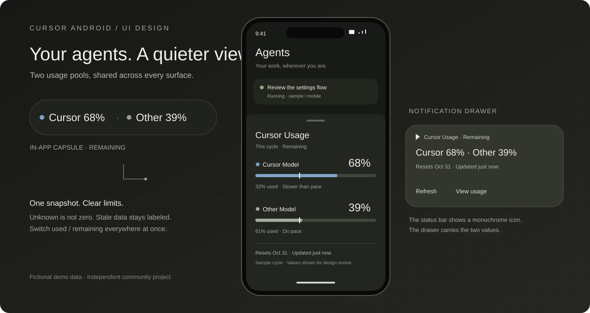
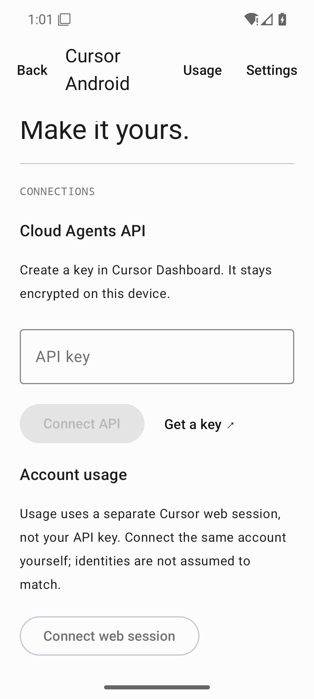
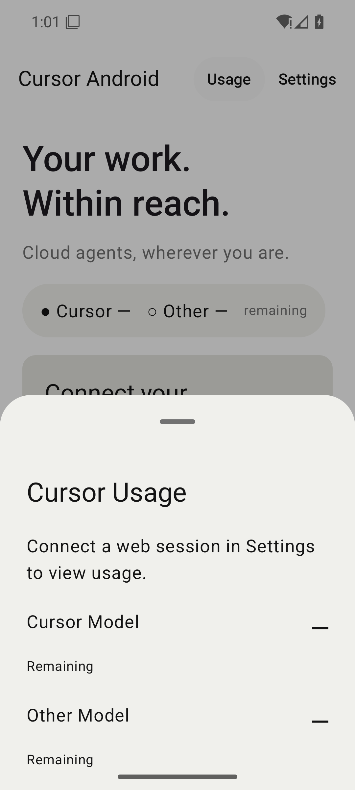
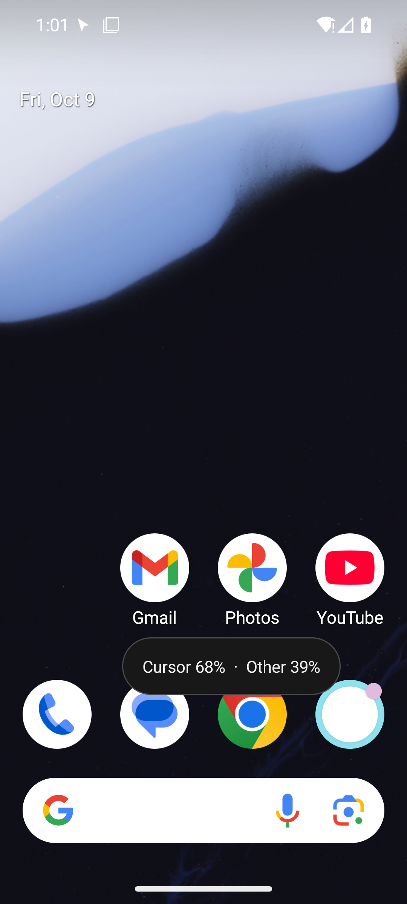

<div align="center">

# Cursor Android

**Your agents. A quieter view.**

A native Android companion for Cursor Cloud Agents, with two-pool usage at a glance.

English · [简体中文](README.zh-CN.md)

[Website](https://cursor-android.app) ·
[Releases](https://github.com/occcat/cursor-android/releases) ·
[Documentation](docs/README.md) ·
[Report an issue](https://github.com/occcat/cursor-android/issues)

</div>



*UI design illustration with fictional data. This is an independent community project,
not an official Cursor application or an affiliation with Cursor.*

## Keep work moving

Start a Cloud Agent, follow its run, and return to the result from your phone.
The native app uses Cursor's official v1 API for Agent workflows and a separate web
session for account usage. A compact capsule keeps **Cursor Model** and **Other Model**
visible without turning your screen into a dashboard.

- **Agents first.** Inbox, local search, archive/restore, creation, run updates,
  follow-ups, cancellation, and artifacts.
- **Two pools, clearly named.** One usage snapshot drives the in-app capsule,
  expanded details, and notification. Remaining is the default; used is optional.
- **Home-screen widgets.** Resize Usage, Recent Agents, and Quick Actions to fit
  your launcher; keep cached information and common app entries close.
- **Android throughout.** Kotlin, Jetpack Compose, Navigation 3, ViewModel, Room,
  DataStore, Hilt, and WorkManager. English by default, optional Chinese.
- **Clear web boundaries.** Advanced work panels and account management open Cursor's
  website. Their presence in the API research does not imply native implementation.

The project is in its initial implementation stage. See the [validation record](docs/validation.md)
for completed checks and remaining live-account/device verification. Source is public;
this repository does not currently declare a redistribution license.

## Native previews

<p align="center">
  
  
  
</p>

*Actual API 36 emulator captures at 320 dp: separate connections, signed-out usage, and the
native overlay. The overlay's 68% / 39% values are injected test fixtures, not live
account usage. No account credentials or paid Agent run were used for these captures.*

## Try it

### Install a published build

Open [Releases](https://github.com/occcat/cursor-android/releases) and choose an available
APK named `cursor-android-<version>.apk`. Availability depends on a published, signed
release; if no APK is listed, build from source below. The website only offers assets
that actually exist. There is no claimed Play Store listing.

Connect a user API key from your [Cursor Dashboard](https://cursor.com/dashboard) for
native Agent workflows. Account usage uses a separate **Sign in to Cursor** web session
inside the app. API keys do not grant access to the web usage endpoint. Existing web
history visibility and SSO behavior depend on Cursor's account/API support.

## Build

Install Android Studio or Android command-line tools with **Android SDK 36**, and
use the tested **JDK 21** toolchain. The app supports Android 8.0 / API 26 and later; current compile
and target SDK are 36. The repository supplies the Gradle wrapper. Set Android
Studio’s Gradle JDK to 21, or point `JAVA_HOME` at a JDK 21 installation. On macOS:

```sh
export JAVA_HOME="$(/usr/libexec/java_home -v 21)"
```

```sh
git clone https://github.com/occcat/cursor-android.git
cd cursor-android
./gradlew :app:assembleDebug
```

The debug APK is written to `app/build/outputs/apk/debug/app-debug.apk`.
Open the repository in Android Studio to run it on an emulator or connected device.
Keep SDK locations in your local environment or untracked `local.properties`.

### Explore the design

The [website](https://cursor-android.app) presents the product and an interactive usage
sample. The [standalone prototype](docs/design/cursor-android-prototype.html) can also
be served locally:

```sh
python3 -m http.server 8765 --bind 127.0.0.1 --directory docs/design
```

Open [localhost:8765/cursor-android-prototype.html](http://127.0.0.1:8765/cursor-android-prototype.html).
Switch English/Chinese, normal/low/offline/signed-out states, used/remaining, and pool
visibility. Demo values are fictional and the prototype never requests credentials.

## What runs where

| Area | Android delivery | Boundary |
| --- | --- | --- |
| Inbox, search, archive/restore | Native | Public v1 records; cached local search |
| New Agent | Native | Prompt, repositories, discovered model, cloud environment, plan/agent mode |
| Runs and follow-ups | Native | SSE updates, cancellation, artifacts; no invented missing history |
| Environments and Secrets | Native | Configuration and Secret metadata/write/delete under key permissions |
| Cursor Model / Other Model | Native | Separate web session; unknown and stale states stay explicit |
| Capsule and usage notification | Native | Monochrome system icon; two values in the notification drawer |
| Home-screen widgets | Three resizable native families | Shared usage/cache; titles private by default; actions open the app |
| Optional cross-app capsule | Permission-gated overlay | User starts/stops it; Android controls lifetime and background work |
| Desktop, Terminal, Files | Cursor website | Web handoff, not native VM transports |
| Automations and Codebase | Cursor website | Server-side capability and account entitlement |
| Billing, provider binding, advanced account settings | Cursor website | Managed through Cursor's existing flows |

This table describes implementation scope, not a claim that every real-account/device
combination has passed testing. Detailed status belongs in the validation record.

## The capsule, designed for Android

Cursor Model comes from `individualUsage.plan.autoPercentUsed`; Other Model comes
from `individualUsage.plan.apiPercentUsed`. With used values 32 and 61, remaining is
68 and 39. Switching the metric updates every label, number, bar, and pace marker.
Missing data is `—`, unlimited is `∞`, and a failed refresh keeps a labeled old snapshot.
A cycle boundary never resets quota locally without a fresh server response.

Android's ordinary status bar displays a monochrome notification icon. The two values
belong in the drawer, in the app, or in a separately permitted overlay. Foreground
refresh and inexact WorkManager background sync do not promise perpetual live updates.
Read the [UI specification](docs/design/cursor-android-ui.md) for sizing, colors,
accessibility, pace, and permission behavior.

## Home-screen widgets

Long-press the home screen, open **Widgets**, and choose a Cursor Android widget.
Touch and hold an added widget to resize it where your launcher allows.

| Widget | Intended grid sizes | What it shows |
| --- | --- | --- |
| Usage | 2×1, 4×1, 2×2, 4×2 | Two pool values; larger layouts add bars and freshness |
| Recent Agents | 2×2, 4×2, 4×3 | Cached state and Agent detail links; titles are private by default |
| Quick Actions | 2×1, 4×1 | Inbox + New Agent; the wide layout also adds Usage + Settings |

Grid cells vary by launcher; these are hints, not guaranteed cell counts. For example,
the tested Pixel Launcher labels compact Usage 2×2 to satisfy its minimum height.
The [widget guide](docs/design/home-screen-widgets.md) lists the actual dp layout bounds.
Widgets share the app's used/remaining and pool-visibility settings. Agent titles can
be enabled in Settings. Refresh is bounded and background work is inexact. Agent
**ACTIVE** is not a claim that its latest Run is **RUNNING**. **New Agent** opens the
composer; it never sends a prompt by itself.
No overlay permission is required for a home-screen widget.

## Architecture and API research

Compose observes ViewModel state. Repositories coordinate official API calls, a
separate web usage session, Room snapshots, and preferences. Credentials stay within
their intended origin and use Android Keystore protection. Signed artifact URLs and
VM credentials must not become persistent account secrets.

The ego audit covers Agents, settings, environments, usage, and working panels:
**428 public JS chunks**, **857 route candidates**, **123 observed paths** (120 with
responses), and **57 documented public operations**. Full catalogs retain evidence
and protocol details.

These are evidence counts, **not 857 verified APIs**. Every catalog entry retains its
observation/call/descriptor/candidate classification. Start with the
[web inventory](docs/cursor-api-inventory.md), [public API](docs/cursor-public-api.md),
and [Android plan](docs/android-implementation-plan.md).

## Development and releases

```sh
./gradlew :app:testDebugUnitTest :app:lintDebug :app:assembleDebug
node --test website/test/*.test.mjs
node website/scripts/build.mjs
python3 docs/scripts/check-docs.py
```

With a connected emulator/device, also run `./gradlew :app:connectedDebugAndroidTest`.
The [test plan](docs/testing.md) separates unit/contract checks, ego browser QA,
live-account checks, and device behavior.

Cloudflare Pages builds main and serves [cursor-android.app](https://cursor-android.app).
A release-triggered deploy hook refreshes the website's current release information.
Configuration and verification steps are in the [deployment guide](docs/deployment.md).
Never commit the deploy-hook URL, API keys, keystores, or generated build output.

Follow [CONTRIBUTING](CONTRIBUTING.md) and [AGENTS.md](AGENTS.md) for small scoped changes,
multiline Conventional Commits, and the separate version bump required before release.

## Design references

The two-pool visual and pace behavior adapts the Cursor Usage portion of the sibling
`grok-usage-floating` project. The README's product-first structure is informed by
[ego lite](https://github.com/citrolabs/ego-lite). The website's section rhythm takes
inspiration from [Vibe Island](https://vibeisland.app), with a restrained visual language
informed by [Cursor](https://cursor.com). Artwork and demo content here are original;
no testimonials, endorsements, or official affiliation are implied.
