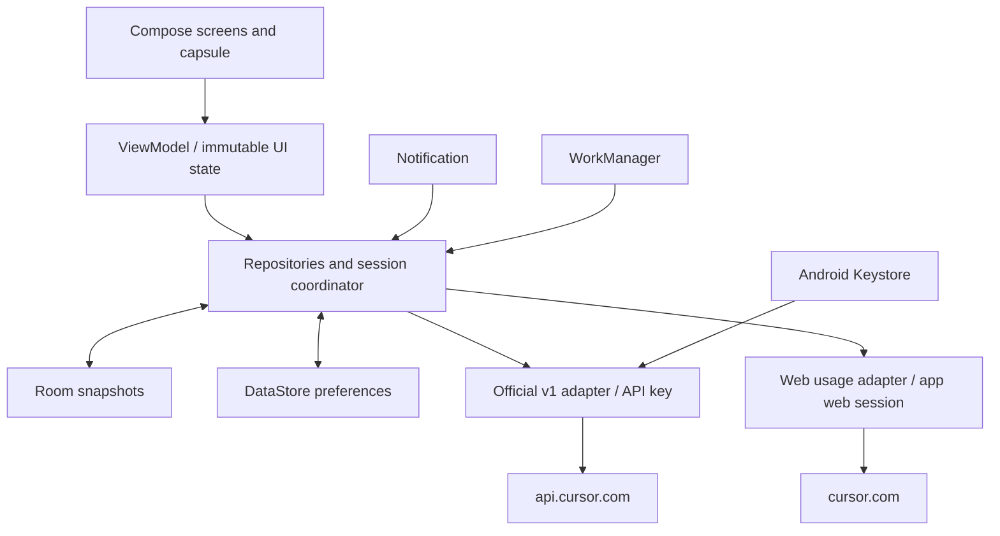

# Android implementation plan

This is the architecture and acceptance plan. The [README](../README.md) and
[validation record](validation.md) describe what is delivered and actually tested.
Research dates: October 8–9, 2026. English is the default; Chinese is optional.

The app controls Cursor Cloud Agents and presents two account usage pools:
**Cursor Model** and **Other Model**. Account billing, provider binding, and advanced
web-only capabilities open Cursor's website. An external web entry is never labeled
as a completed native implementation.

## Platform and architecture

Follow Google's [architecture recommendations](https://developer.android.com/topic/architecture/recommendations):
Kotlin, Compose, a single Activity, unidirectional state, ViewModel, coroutines/Flow,
lifecycle-aware state collection, repositories, Room for durable domain snapshots,
and DataStore for preferences. Navigation 3 is Google's current Compose recommendation;
use it where supported by the pinned dependency/toolchain combination.
The [offline-first guide](https://developer.android.com/topic/architecture/data-layer/offline-first)
provides the local-source-of-truth model. The implemented Gradle files are authoritative
for exact versions, SDK levels, and tasks.



Prefer a small working module structure with explicit model/data/ui/security packages;
split Gradle modules when dependency or test isolation warrants it. Compose does not
parse HTTP, access CookieManager, or query database tables. DTOs map into domain
models, then immutable UI state. One UsageRepository feeds every surface and coalesces
refresh requests. Native controls and web pages share clear connection/Agent identity.

## Capability and authentication boundaries

| Capability family | Primary channel | Delivery boundary |
| --- | --- | --- |
| Agents, runs, creation, follow-up, cancel, archive | Official v1 | API-key scope and public API access |
| Models and repositories | Official v1 discovery | Dynamic models; GitHub-only repository listing |
| Environments, history, builds, Secrets | Official v1 | Permission/scope/version-aware; values are write-only |
| Account subscription usage | Web usage-summary | A separate, valid web session is required |
| Cloud Agent preferences | Web patch adapter or browser entry | Partial patches and team policy, not local-only fiction |
| Pin/read/custom lists, Fork/Side Chat | Verified web adapter or browser | Do not infer parity from endpoint names |
| Automations, Codebase, plugins/MCP | Verified supported fields or browser | Server execution and actual entitlement |
| Changes, files, terminal, desktop | Native adapters or clearly named web entry | Each protocol needs separate testing |
| Home-screen widgets | Jetpack Glance / shared snapshots | Three resizable families; explicit navigation; private titles by default |
| Appearance, language, metric, visibility, refresh | Local DataStore | Does not change Cursor account defaults |
| Billing, account, SCM binding | Browser | Kept in Cursor's existing management flows |

A feature can be available, require a key/session, be unavailable to this account,
be unverified, or temporarily fail. Loading is not a missing entitlement.
A documented endpoint alone does not enable a product control.

The public API key and the app's web session remain isolated. API Authorization is
sent only to the exact official API origin, never to web or artifact hosts or arbitrary
redirect targets. Store credentials with Android Keystore protection; exclude them,
web sessions, and sensitive drafts from backup and logs. Do not bundle service-account
administrator keys.

WebView cookies belong to this app's CookieManager. Android Custom Tabs and the system
browser do not provide a cookie-export mechanism. No verified Cursor mobile OAuth or
device-code contract was found. If SSO disallows embedded login, explain that limit
and retain API-key mode plus browser management. Do not copy another app's cookies or
invent a token exchange. Avoid unrestricted JavaScript/native bridges.
See [Custom Tabs](https://developer.android.com/develop/ui/views/layout/webapps/overview-of-android-custom-tabs)
and [CookieManager](https://developer.android.com/reference/kotlin/android/webkit/CookieManager).

Validate web/public account and team correspondence before combining records. Domain
keys include connection/source plus remote ID, even where ID strings look identical.
On disconnect, advance a session generation, cancel streams/requests, clear credentials,
remove sensitive notifications/cache, and reject late responses from the old account.
401 or explicit authentication errors expire the connection; a general 403 remains a
permission/policy error.

## State, streams, and offline behavior

Agent lifecycle differs from Run execution status. Represent unknown enums without
crashing. Keep locally sent prompts and send status because v1 does not expose a full
conversation endpoint or original prompts in Run DTOs. Do not invent missing history.

```text
Authentication: signedOut → authenticating → active → expired
Stream: idle → connecting → streaming → reconnecting / ended / snapshotOnly
Send: editing → validating → submitting → accepted / failed / outcomeUnknown
Run: creating → running → finished / error / cancelled / expired
Usage: loading → fresh / partial / unavailable / signedOut; a cached value can be stale
```

Use Room transactions to apply parsed/validated events and the checkpoint together.
Resume SSE with the last durably applied opaque Last-Event-ID. ID-free status is an
upsert; result and done may share an ID. Deduplicate using adequate event identity,
not a global event-ID primary key. Use either simplified events or rich interaction
updates for rendering to avoid duplicate text. A 410 stream_expired switches to a Run
snapshot and labels unavailable history. Private Connect streams need their own
framing/offset reducer; SSE rules are not transferable.

Load cached Agents and usage before synchronization; retain them with fetched time
when reads fail. A fresh account must not briefly see the previous account's data.
Bound text/tool/media caches; download large artifacts on demand. After process
restart, confirm remote status before assuming a cached running state is current.

| Failure | Response |
| --- | --- |
| Network, timeout, temporary 5xx | Retain snapshot; backoff/jitter for safe reads |
| 429 | Honor Retry-After and coalesce requests |
| 401 | Stop retries, reconnect explicitly |
| 403 | Explain entitlement/policy; avoid login loops |
| 409 busy/conflict | Refresh current state; do not cancel or overwrite automatically |
| 410 stream retention | Fetch Run snapshot and show a history gap |
| Unknown write outcome | Reconcile remote state before a deliberate retry |
| Repeated pagination cursor | Stop loading, keep data, report synchronization failure |

No automatic retry of ambiguous creation, follow-up, terminal input, Secret write,
or automation activation. Offline work remains a draft; connectivity restoration
must not execute old intent silently. Repository discovery is cached because its
limit is one request/minute and 30/hour.

## Usage and system surfaces

The [UI contract](design/cursor-android-ui.md) is authoritative for pool mapping,
normalization, unknown/unlimited states, pace, and accessibility. Only finite numbers
or valid numeric strings are percentages. A missing value is never zero.
A cycle that has ended remains stale until a new server snapshot arrives.

Foreground polling options are 30/60/120/300 seconds, default 60, subject to actual
service limits. Recalculate local pace without requesting the server. Pause stops
automatic refresh, not access to cached data. Coalesce refreshes across all surfaces.
Ordinary background work uses WorkManager, with a minimum periodic interval of
15 minutes and no punctuality guarantee. No second-by-second background promise.

A status-bar notification uses a monochrome small icon. The drawer shows two values;
it should use standard/BigTextStyle templates with a privacy-safe lock-screen view.
API 33+ requests POST_NOTIFICATIONS from a user action. Permission rejection does not
remove the in-app capsule. Channels separate quiet usage updates from run events.

Home-screen widgets use Glance and the same account-scoped snapshots. Usage, Recent
Agents, and Quick Actions support responsive layouts; their exact grid size depends
on the launcher. Titles require an explicit visibility preference. Activity actions
open native screens and never execute paid work automatically. See the
[widget guide](design/home-screen-widgets.md). Widgets are distinct from overlays.

An optional cross-app capsule needs SYSTEM_ALERT_WINDOW and lies below system bars
and the keyboard. It must have an explicit start/stop and permission-revocation path.
A perpetual dataSync foreground service is not an acceptable keepalive: target 35+
has a six-hour background budget per 24 hours. Other FGS types need a legitimate
purpose and appropriate declarations. Live Updates are optional for actively tracked
runs, not a guarantee of a persistent quota chip.

Sources: [WorkManager](https://developer.android.com/develop/background-work/background-tasks/persistent-work/getting-started/define-work),
[notification permission](https://developer.android.com/develop/ui/views/notifications/notification-permission),
[FGS timeouts](https://developer.android.com/develop/background-work/services/fgs/timeout),
[overlay layers](https://developer.android.com/reference/android/view/WindowManager.LayoutParams).

## Working panels and write safety

Files must preserve dirty edits and handle unknown write outcomes; the audited API
has no established revision conflict contract. Downloads must not silently save edits.
Terminal attach/reconnect must not replay input or automatically kill the shell on
navigation. Decode partial UTF-8 across frames and cap buffers.
Desktop defaults to view-only; acquiring control is explicit. Release lease on exit,
background, expiry, or loss of renewal. Temporary VM credentials remain in memory.
Secret editors never display old plaintext and clear entered values on completion or
navigation. Account-level web settings use patch + refetch, respecting locked team policy.

## Milestones and acceptance gates

1. **Foundation:** buildable app, models, persistence, credentials, default English,
   optional Chinese, deterministic fake data for tests only.
2. **Native core:** v1 Agents/runs/models/repos, creation/follow-up/cancel, live events,
   cached state, errors, and genuine two-pool usage when the web session is available.
3. **System/UI:** in-app capsule, details, notification and permission handling,
   responsive/accessibility behavior, safe background synchronization.
4. **Web parity:** add individual verified adapters for settings, environment, diff,
   terminal/files/desktop and automations; document browser-only entries honestly.
5. **Release:** meaningful automated checks, required device/account verification,
   release version bump, signed artifact when signing is configured, website refresh.

The full test matrix and actual results live in [testing](testing.md) and
[validation](validation.md). Original Chinese design is retained
[here](zh-CN/android-implementation-plan.md). The plan does not turn pending account,
device, or advanced-panel work into a passed test.
